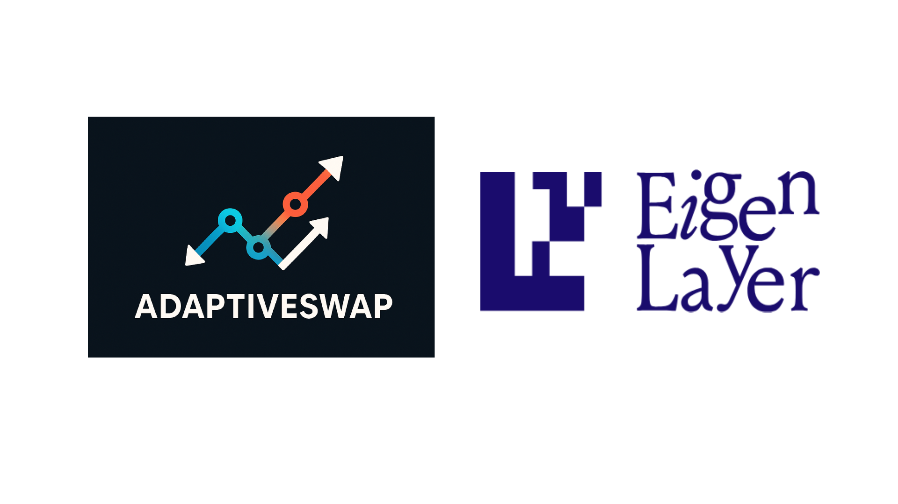
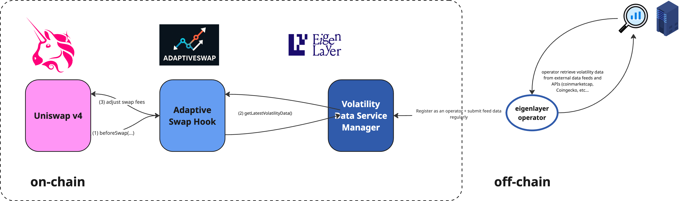

# Adaptive Swap AVS

> Based on the [Eigenlayer Hello World AVS Template](https://github.com/Layr-Labs/hello-world-avs) > [Video presentation](https://www.loom.com/share/4f95779cad3b4871a3e631428ca6c686)

Welcome to the Adaptive Swap AVS!



## Architecture



As shown in the diagram above, the `VolatilityDataServiceManager` contract act as an oracle for the Adaptive Swap hook.

1. The AVS operator register to the AVS and fetch data regular from external API sources.

2. The AVS operator regularly pushes data (_e.g: every minutes_) to the `VolatilityDataServiceManager` contract to provide volatility data on-chain.

3. During a swap, the Adaptive Swap Hook contract (which is the AVS consumer) consumes the latest volatility data submitted by the operator.

4. The Hook contract override the swap fees based on the latest volatility.

## Quick start

The instructions below explain how to manually deploy the AVS from scratch including EigenLayer and AVS specific contracts using Foundry (forge) to a local anvil chain, and start Typescript Operator application and tasks.

### Step 1 - Start Anvil Chain

In terminal window #1, execute the following commands:

```sh
# Install npm packages
npm install

# Start local anvil chain
npm run start:anvil
```

### Step 2 - Deploy Contracts and Start Operator

Open a separate terminal window #2, execute the following commands

```sh
# Setup .env file
cp .env.example .env
cp contracts/.env.example contracts/.env

# Updates dependencies if necessary and builds the contracts
npm run build:forge

# Deploy the EigenLayer contracts
npm run deploy:core

# Deploy the Volatility Data AVS contract
npm run deploy:volatility-data-avs

# (Optional) Update ABIs
npm run extract:abis
```

<!-- TODO: define if this step is still needed
# Start the Operator application
npm run start:operator
 -->

### Step 3 - Run the Data Feed

After deploying the `VolatilityDataServiceManager` contract, in the same terminal window, execute the following command to push regularly volatility data to be consumed by the smart contract.

```sh
# Start the createNewTasks application
npm run start:data-feed
```

## Development Environment

This section describes the tooling required for local development.

Install dependencies:

- [Node](https://nodejs.org/en/download/)
- [Typescript](https://www.typescriptlang.org/download)
- [ts-node](https://www.npmjs.com/package/ts-node)
- [tcs](https://www.npmjs.com/package/tcs#installation)
- [npm](https://docs.npmjs.com/downloading-and-installing-node-js-and-npm)
- [Foundry](https://getfoundry.sh/)
- [ethers](https://www.npmjs.com/package/ethers)

## Debugging

For help and support deploying and modifying this repo for your AVS, please:

1. Open a ticket via the intercom link at [support.eigenlayer.xyz](https://support.eigenlayer.xyz).
2. Include the necessary troubleshooting information for your environment:

- Local anvil testing:
  - Redeploy your local test using `--revert-strings debug` flag via the following commands and retest: `npm run deploy:core-debug && npm run deploy:volatility-data-avs-debug`
  - Analyze the full stacktrace from your error as a `.txt` file attachment.
- Holesky testing:
  - Ensure contracts are verified on Holesky. Eg `forge verify-contract --chain-id 17000 --num-of-optimizations 200 src/YourContract.sol:YourContract YOUR_CONTRACT_ADDRESS`

## Disclaimers

This repo is meant as a PoC project for the Uniswap hookathon to be used with _local anvil development testing_.
